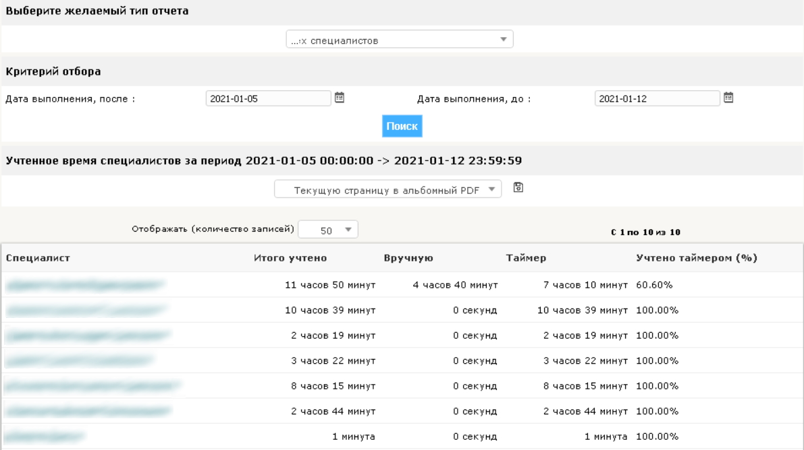
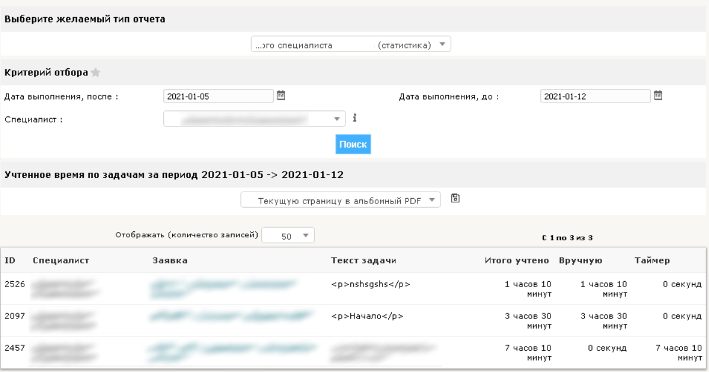
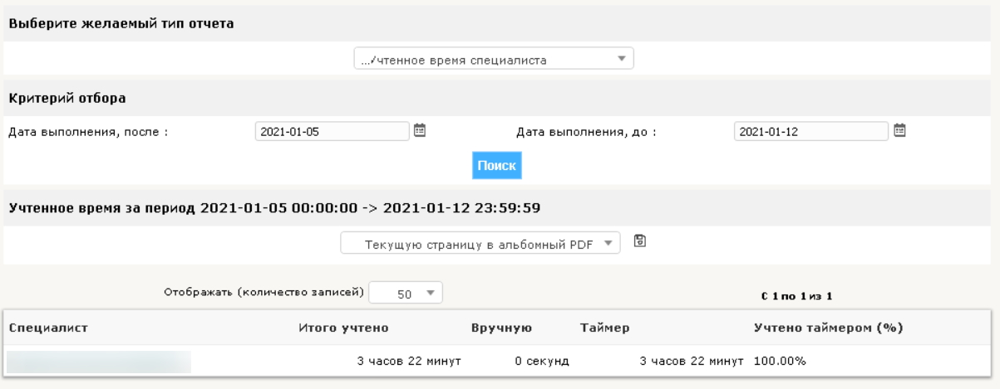
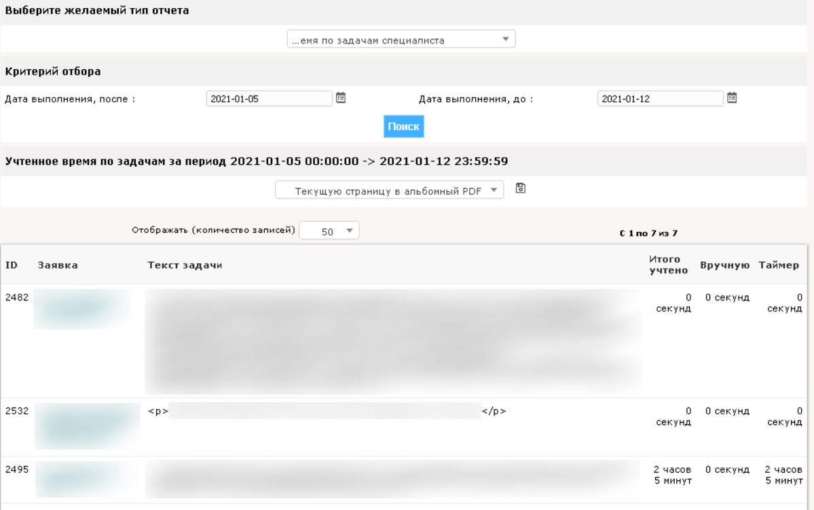
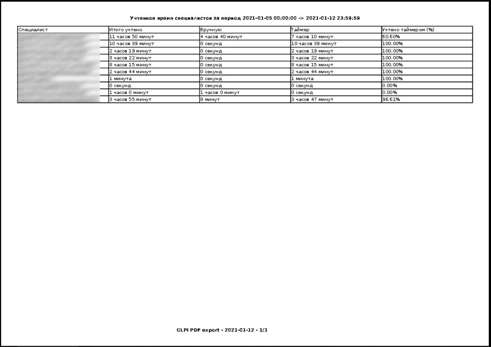

## Описание
Репозиторий содержит дополнительные отчеты для плагина ActualTime для GLPI (ссылка на репозиторий плагина https://github.com/ticgal/actualtime). \
Во всех отчетах считается время выполнения в задачах, у которых поставлена галочка (т.е. она выполнена).\
У каждой задачи есть учтенное время выполнения. Оно бывает двух видов: ручное и автоматическое (=таймером).\
В каждом отчете выводится информация об учтенном времени:\
суммарном (ручное + автоматическое), ручном, автоматическом и процент автоматического от суммарного.
Всего 4 отчета:
* allTechTime - учтенное время всех специалистов.
Фильтр по дате выполнения задач.\
Предназначен для получения статистики руководством.\
На выходе: список специалистов с показателями учтенного времени.

* allTechTimeTask - учтенное время выбранного специалиста по задачам.
Фильтр: по дате выполнения задач, по специалисту.\
Предназначен для получения статистики специалиста по задачам руководством.\
На выходе: список задач выбранного специалиста с показателями учтенного времени.

* techTime - учтенное время специалиста.
Фильтр по дате выполнения задач.\
Предназначен для получения собственной статистики специалистом. \
На выходе: показателями учтенного времени пользователя, который этот отчет запросил.

* techTimeTask - учтенное время специалиста по задачам.
Фильтр по дате выполнения задач.\
Предназначен для получения собственной статистики по задачам специалистом.\
На выходе: список задач показателями учтенного времени пользователя, который этот отчет запросил.

В отчетах учитывается выбранная организация (Entity) и тип выбора (со структурой или без).
## Установка
1. Скачать последний релиз (доступен по ccылке https://github.com/ershov-a/actualtimeExtraReports/releases/latest).
2. Распаковать архив.
3. Переместить 4 папки (allTechTime, allTechTimeTask, techTime, techTimeTask) по пути `КОРНЕВАЯ_ПАПКА_GLPI/plugins/actualtime/report`.
4. В GLPI Администрирование - Профили - выбрать профиль - Отчеты - поставить галочку напротив отчеты для этого профиля.
5. Выйти и зайти в GLPI (применение прав доступа к отчетам применяются при входе).
## Скриншоты
**allTechTime** - учтенное время всех специалистов.

**allTechTimeTask** - учтенное время выбранного специалиста по задачам.

**techTime** - учтенное время специалиста.

**techTimeTask** - учтенное время специалиста по задачам.

**Отчет в PDF**

## Дополнения
1. HTML теги в тексте задаче отображаются как есть, т.е. например `
Начало
` так и будет отображаться в отчете
2. Названия отчетов, которые отображаются в выпадающем меню, изменяются в соответствующих языковых файлах (название_отчета.ru_RU.php).
3. Для корректного отображения названий в выпадающем меню в файле glpi/plugins/report/inc/function.php закомментирована строка и
добавлена другая (закомментирована зеленая строка 68, добавлена красная).
Строка 68  - https://forge.glpi-project.org/projects/reports/repository/diff/tags/1.14.0-GLPI_9.5/inc/function.php?utf8=%E2%9C%93&rev=386&rev_to=370).
По всей видимости в версии 1.5.0 Additional Reports (reports) изменили способ поиска языковых файлов. Это отчеты построены на базе reports.
4. Название, которое отображается под фильтрами, изменяется в самом отчете (в соответствующем php файле, e.g. название_отчета.php).
